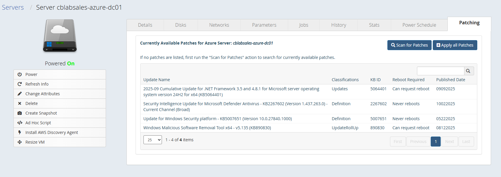

# Azure Patches UI Extension
This CloudBolt UI Extension adds a custom "Patching" tab to the VM details page for an Azure Virtual Machine

## Features
- Displays a list of available patches for the selected Azure VM
- Allows users to initiate scan and patching operations directly from the UI
- Provides real-time status updates on patching progress
- Integrates with Azure Update Management to fetch patch information

## Prerequisites
- Service principal used for the Resource Handler where the server lives should have appropriate permissions to query Azure Patching data
- Server you are working with must be an Azure Virtual Machine
- VM must have the Azure VM Agent installed and running

## Installation
1. Copy the azure_patches directory to the `/var/opt/cloudbolt/proserv/xui/` directory on your CloudBolt server.
2. Restart Apache on the CloudBolt server to load the new extension:
   ```
   sudo systemctl restart httpd
   ```
3. Navigate to a VM details page in the CloudBolt UI to see the new "Patching" tab.

### Patching Tab
 