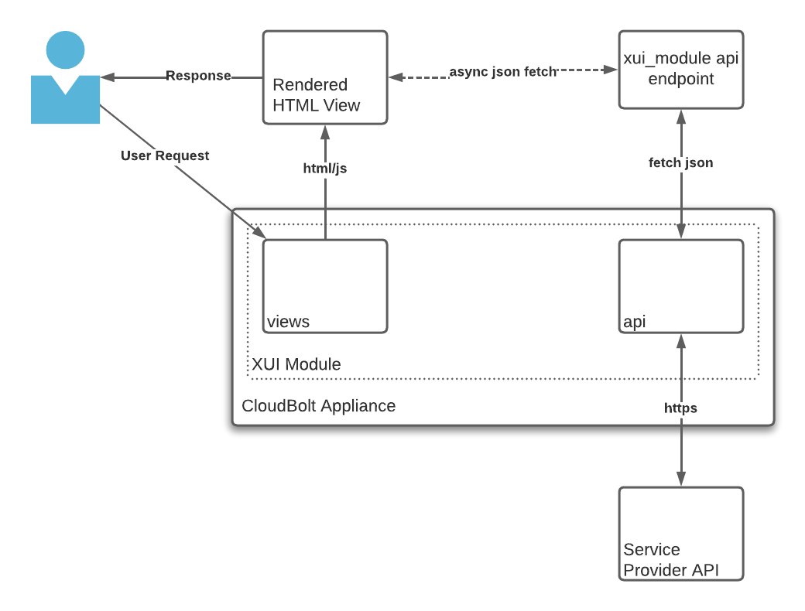

# XUI Playground
_A Brief Introduction to XUIs_

## Overview
This XUI demonstrates a technique for incorporating external content from an API that is not local to the CloudBolt
instance on which this XUI is installed. This non-local resource could be an external tool or system such as a 
monitoring system, security assessment tool, or any system capable of producing content as part of an API call.

To enable the integration of this external content, a server-side view is used to produce JSON from an external API
call with a Javascript WebComponent that executes in the browser to fetch the data from the CloudBolt Server. While
the Javascript WebComponent _could_ call the API directly, more often than not, these calls are not permitted as
part of same-site-origin security policies that are common with modern Web apps.

Calling the API provided by our Service Provider, in this case RandomUser.me, from the server-side script avoids the
restrictions against calling external APIs from Javascript and dramatically simplifies authentication. 



## Setup
For the time being, add the following to customer_settings.py to have CloudBolt pick-up static files. NOTE: An improved
method for handling static assets in XUIs is coming in the near future.

```
from settings import STATICFILES_DIRS, PROSERV_DIR
STATICFILES_DIRS += PROSERV_DIR + "/xui/playground/static",
```

Once this is in-place, restart CloudBolt and then run `/opt/cloudbolt/manage.py collectstatic --noinput`.
