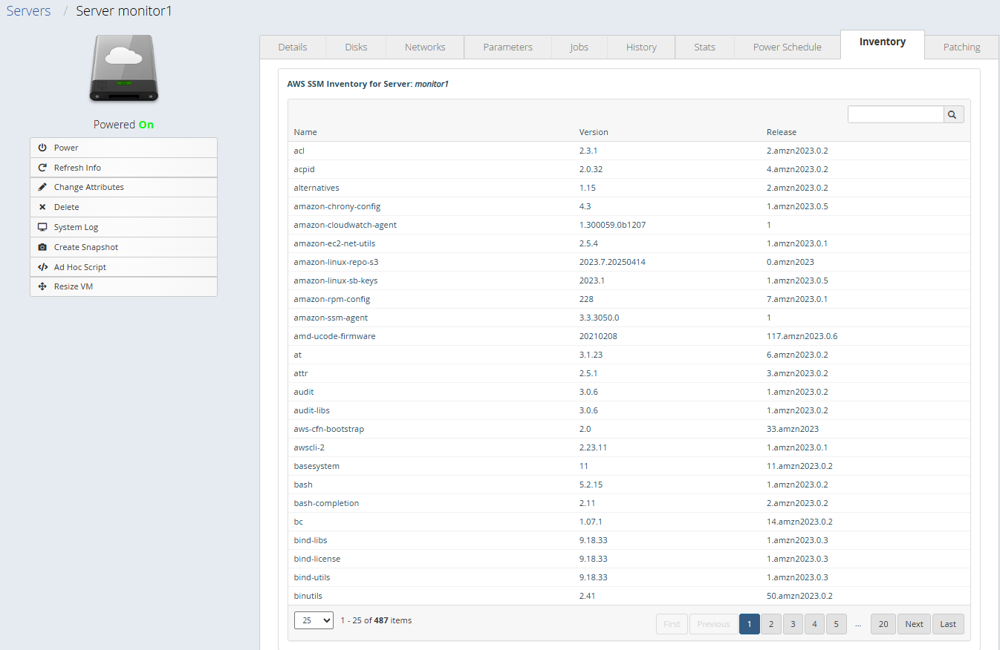
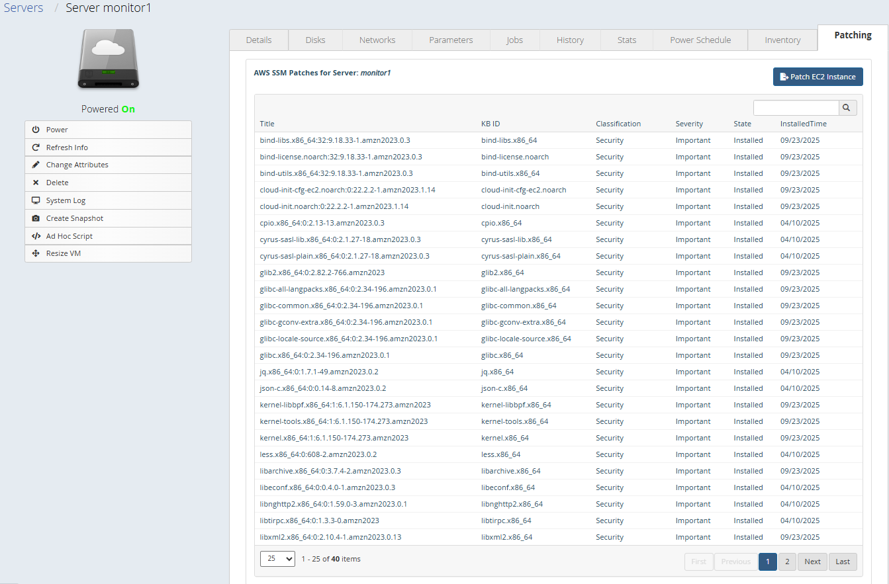

# AWS SSM Inventory UI Extension
This CloudBolt UI Extension contains a simple web application that serves as a user interface extension for AWS Systems Manager (SSM) Inventory. The application allows users to view and manage their SSM Inventory data and Patching from a CloudBolt Server.

## Features
- View AWS SSM Inventory data
- View Patching status information
- Filter and search inventory and patching data
- Initiate patching operations

## Prerequisites
- CloudBolt Server must be an AWS AC2 Instance
- Service principal used for the Resource Handler where the server lives should have appropriate permissions to query SSM Inventory and Patching data
- Server you are working with must be an Azure Virtual Machine
- VM must have the SSM Agent installed and running

## Installation
1. Copy the `ssm_inventory` directory to the `/var/opt/cloudbolt/proserv/xui/` directory on your CloudBolt server.
2. Restart Apache on the CloudBolt server to load the new extension:
   ```
   sudo systemctl restart httpd
   ```
3. Navigate to a VM details page in the CloudBolt UI to see the new "Inventory" and "Patching" tabs.

### Patching Tab


### Inventory Tab
