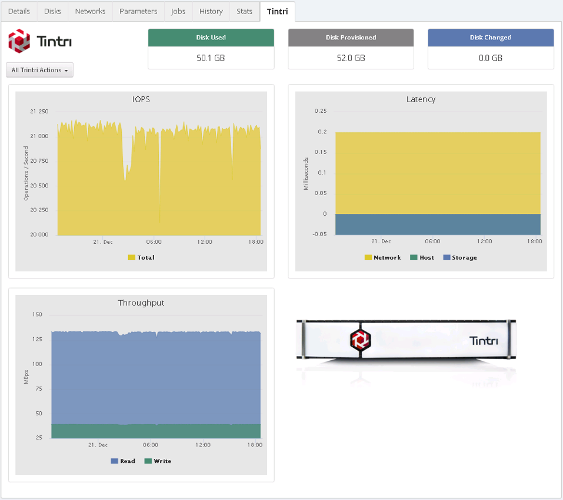

# Tintri UI Extension

[TOC]



## Features
* Throughput, Latency, and IOPS charts
* Disk usage
* Tintri Snapshot action

## Requirements
Install Tintri PySDK on CloudBolt Server:

```
git clone https://github.com/Tintri/tintri-python-sdk.git
cd tintri-python-sdk
pip install Tintri_PySDK-1.0-py2-none-any.whl
```

CloudBolt Connection Info:
* Go to *Admin > Connection Info* and **Add** new connection info

```
Name: tintri
IP/Hostname: <hostname of Tintri VM Store>
Port: 443
Protocol: https
Username: <Tintri Username>
Password: <Tintri Password>
```

## Install UI Exntesion

Upload UI Extnesion:

* Zip up 'tintri' dir **including the subfolders**
* Go to *Admin > Manage UI Extensions* and **upload** the zip file

## Install Server Actions
Upload **clone** Server Action:
* **Not currently enabled**
* Zip up 'tintri_action_clone' dir **including the subfolders**
* Go to *Admin > Server Actions* and **upload** the zip file

Upload **Snapshot** Server Action:
* Zip up 'tintri_action_snapshot' dir **including the subfolders**
* Go to *Admin > Server Actions* and **upload** the zip file

## Enable Server Tab
* Go to *Server Details* tab of a Virtual Machine using Tintri VM Store
* Click the *edit icon* next to Labels and add the following label
    * *tintri*
* The *Trintri Server Tab* will now display for this Virtual Machine